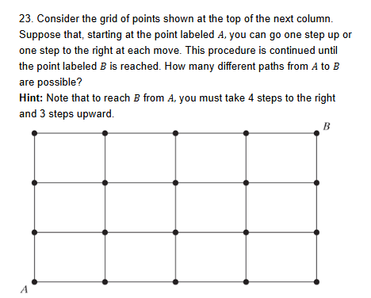
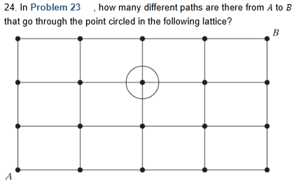
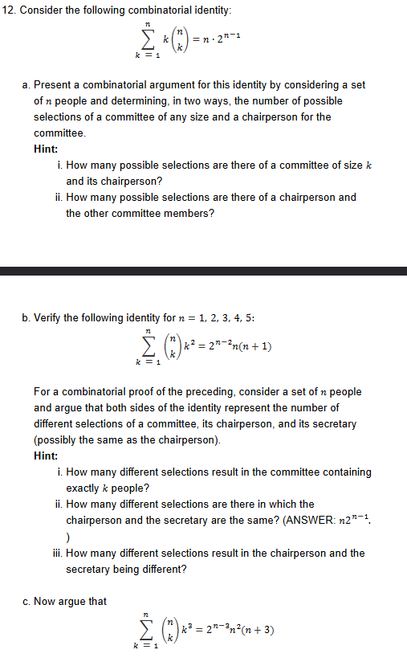

## Homework Assigned on 09/03/2026

### Chi tang Chin

### Tuesday due 09/08/2026
- Page 34-35: 1 4 7 9
- Page 39: 6 8

### Thursday due 09/10/2026
- Page 35-37: 10 12 17 20 23 24
- Page 40: 12

## Page 34-35: 1, 4, 7, 9

### Problem 1

### 1a. How many different 7-place license plates are possible if the first 2 places are for letters and the other 5 for numbers?

Facts:
- letters = 26
- numbers = 0-9 = 10 choices
- Order = Yes
- Repeat = Yes

26 26 10 10 10 10 10

- Multiplicative Rule

26 * 26 * 10 * 10 * 10 * 10 * 10

**ANS: 26^2 * 10^5**

### 1b. Repeat part (a) under the assumption that no letter or number can be repeated in a single license plate.

Facts:
- letters = 26
- numbers = 0-9 = 10 choices
- Order = Yes
- Repeat = No

26 25 10 9 8 7 6

- Multiplicative Rule

26 * 25 * 10 * 9 * 8 * 7 * 6

**ANS: 26 * 25 * 10 * 9 * 8 * 7 * 6**

### Problem 4

### 4. John, Jim, Jay, and Jack have formed a band consisting of 4 instruments. If each of the boys can play all 4 instruments, how many different arrangements are possible? What if John and Jim can play all 4 instruments, but Jay and Jack can each play only piano and drums?

First question: If each of the boys can play all 4 instruments, how many different arrangements are possible?

Facts:
- John, Jim, Jay, and Jack = 4 people
- consisting of 4 instruments total
- Order = Yes
- Repeat = No

4 3 2 1

- Multiplicative Rule

**ANS: 4 * 3 * 2 * 1**

Second Question: What if John and Jim can play all 4 instruments, but Jay and Jack can each play only piano and drums?

Facts:
- John, Jim, Jay, and Jack = 4 people
- 4 Instruments for John and Jim
- 2 Instruments for Jay and Jack
- Order = Yes
- Repeat = No

2 1 2 1

- Multiplicative Rule

2 * 1 * 2 * 1

**ANS: 2^2 * 1^2**

### Problem 7

### 7a. In how many ways can 3 boys and 3 girls sit in a row?

Facts:
- 3 boys
- 3 girls
- 6 people total
- Order = Yes
- Repeat = No

6 5 4 3 2 1

- Multiplicative Rule

**ANS: 6 * 5 * 4 * 3 * 2 * 1**

### 7b. In how many ways can 3 boys and 3 girls sit in a row if the boys and the girls are each to sit together?

Facts:
- 3 boys
- 3 girls
- Order = Yes
- Repeat = No
- boys sit together
- girls sit together

- Multiplicative Rule

BBB GGG
GGG BBB

**ANS: (2 * 1) * (2 * 1) * (3 * 3 * 2 * 2 * 1 * 1)**

### 7c. In how many ways if only the boys must sit together?

Facts:
- 3 boys
- 3 girls
- Order = Yes
- Repeat = No
- boys sit together
- girls sit anywhere

BBB G G G
G BBB G G
G G BBB G
G G G BBB

4 3 2 1 3 2 1

- Multiplicative Rule

**ANS: (4 * 3 * 2 * 1) * (3 * 2 * 1)**

### 7d. In how many ways if no two people of the same sex are allowed to sit together?

Facts:
- 3 boys
- 3 girls
- Order = Yes
- Repeat = No
- boys cannot sit next to girl
- girls cannot sit next to boy
- Seat must alternate

B G B G B G
G B G B G B

**ANS 2 * (3 * 2 * 1) * (3 * 2 * 1)**

### Problem 9

### 9. A child has 12 blocks, of which 6 are black, 4 are red, 1 is white, and 1 is blue. If the child puts the blocks in a line, how many arrangements are possible?

Facts:
- total 12 blocks
- 6 black
- 4 red
- 1 white
- 1 blue
- Order = Yes
- Repeat = No

C(12, 6) * C(6, 4) * C(2, 1) * C(1, 1)

C(n, r) = n! / (r! * (n-r)!)

C(12, 6) = (12 * 11 * 10 * 9 * 8 * 7) / (6 * 5 * 4 * 3 * 2 * 1)
C(6, 4) = (6 * 5) / (2 * 1)
C(2, 1) = 2
C(1, 1) = 1

**ANS: (12 * 11 * 10 * 9 * 8 * 7) / (6 * 5 * 4 * 3 * 2 * 1) * (6 * 5) / (2 * 1) * (2) * (1)**

## Page 39: 6, 8

### Problem 6

Question is asking for x1, ..., xk vectors where each xi is positive and x1 ... xk is always increasing

- No repeats
- Order matters
- Vector = k
- total number = n

Sample set:
{1,2,3,4,5}

valid vectors:
1,2,3
1,2,4
1,2,5
1,3,4
1,3,5
1,4,5
2,3,4
2,3,5
2,4,5
3,4,5

**ANS: (5 * 4 * 3) / (3 * 2 * 1)**

n choose k = n! / (k!(n-k)!)

### Problem 8

Prove:
((n + m) choose r) = (n choose 0 * m choose r) + (n choose 1 * m choose r - 1) + ... + (n choose r * m choose 0)

group A has n obj
group B has m obj

total n + m obj

how many ways can I choose r objects from n + m objects

1. choose 0 from group n choose r from group m
2. choose 1 from group n choose r - 1 from group m
...
choose r from group n choose 0 from group m

Sample set:

- 5 red balls
- 7 blue balls

How many ways can we choose 3 balls from total balls?

(5 + 7) choose 3
- 5 balls choose 0 red * 5 balls choose 3 blue
- 5 balls choose 1 red * 2 blue choose 3 blue
- 5 balls choose 2 red * 1 blue choose 3 blue
- 5 balls choose 3 red * 0 blue choose 3 blue

# Page 35-37: 10 12 17 20 23 24

### Problem 10

10. In how many ways can 8 people be seated in a row if
- a. there are no restrictions on the seating arrangement?
- b. persons  and  must sit next to each other?
- c. there are 4 men and 4 women and no 2 men or 2 women can sit next to each other?
- d. there are 5 men and they must sit next to one another?
- e. there are 4 married couples and each couple must sit together

a. 
- No repeat
- Order

8 * 7 * 6 * 5 * 4 * 3 * 2 * 1

**ANS: 8!**

b.
- A B
- B A

2

Block AB and other 6 people = 7

**ANS: 7! * 2**

c. No 2 women or 2 men can sit next to each other so:
- W M W M W M W M
- M W M W M W M W

2 ways

Then the 4 men and 4 women:
- 4! * 4!

**ANS: 4! * 4! * 2**

d.

(MMMMM) WWW

4!

M = 5!

**ANS: 5! * 4!**

e. 4 Maried couples

MW MW MW MW

**ANS: 4! * 2 * 2 * 2 * 2**

### Problem 12

How many 3 digit numbers xyz with x,y,z all ranging from 0 to 9 have at least 2 of their digits equal. How many have exactly 2 equal digits.

atleast 2 equal = total three equal + exactly two equal

- 000
- 111
- 222
- 333
- 444
- 555
- 666
- 777
- 888
- 999

10 choices of all three equal

lets take 2 7 7

we can arrange this as:

- 277
- 727
- 772

3 Ways

If we change 2 to another digit from 0 to 9
- 9 different digits except 777 because that is three equal

9 * 3

for repeated digit 7 7, we can do this 10 times so:

- 10 * 9 * 3

**ANS: 10 * 9 * 3**

### Problem 17

A dance class consists of 22 students, of which 10 are women and 12 are men. If 5 men and 5 women are to be chosen and then paired off, how many results are possible?

- Order Doesnt Matter
- No Repeat

MW MW MW MW MW (WWWWWMMMMMMM)

5 Men Chosen from group of 12
- 12 * 11 * 10 * 9 * 8
5 Women Chosen from group of 10
- 10 * 9 * 8 * 7 * 6
5 Ways to arrange the chosen partners
- 5 * 4 * 3 * 2 * 1

**ANS: (12 * 11 * 10 * 9 * 8) * (10 * 9 * 8 * 7 * 6) * (5 * 4 * 3 * 2 * 1)**

### Problem 20

A committee of 7, consisting of 2 Republicans, 2 Democrats, and 3 Independents, is to be chosen from a group of 5 Republicans, 6 Democrats, and 4 Independents. How many committees are possible?

Committee
- Order doesnt matter
- no repeat

Groups
- Order does matter
- No repeat

Groups
- 5 choose 2 = 5 * 4 / 2 * 1
- 6 choose 2 = 6 * 5 * 4 / 2 * 1
- 4 choose 3 = 4 * 3 * 2 / 3 * 2 * 1

Comittee
- (5 * 4 / 2 * 1) * (6 * 5 * 4 / 2 * 1) * (4 * 3 * 2 / 3 * 2 * 1)

**ANS: (5 * 4 / 2 * 1) * (6 * 5 * 4 / 2 * 1) * (4 * 3 * 2 / 3 * 2 * 1)**

### Problem 23

R, R, R, R, U, U, U

- No Repeats
- Order Matters

**ANS: (7 * 6 * 5 * 4 * 3 * 2 * 1) / ((4 * 3 * 2 * 1) * (3 * 2 * 1))**

### Problem 24

A -> C -> B

RRUU

- RRUU
- RURU
- RUUR
- URRU
- URUR
- UURR

6 Ways from A to C

C -> B

RRU

- RRU
- RUR
- URR

3 Ways from C to B

Total = 6 * 3

**ANS: 6 * 3**

# Page 40: 12

### Problem 12

a. Set: 5 people

i.
- Possible sections of a committee of size 2
- 1 Chairperson

- 5 Choose 3
- 3 choose 1

A, B, C, D, E

A B C

can be A, or B, or C

(5 * 4 * 3 / 3 * 2 * 1) * (3 * 2 * 1 / 1)

ii. for n * 2^(n-1)

n choices for a chairperson

so n - 1 people remaining

each persmon has 2 choices:
- on committee
- not on committee

Test:
- A or B or C or D or E - chair person
5
- B, C, D, E - in or out of comittee if A was chosen
2 * 2 * 2 * 2

5 * 2^(5-1)

b.

- Secretary
- Chairperson
- Committee

Sample Set: 5 people and committee of 3

If secretary and the chairperson are the same people:

Secretary
- 5 choices = 5
Chairperson
- 1 choice = 1
Committee
- 4 choices left = 2 * 2 * 2 * 2

n * 1 * 2^(n-1)

If secretart and the chairperson are different people:

Secretary
- 5 choices = 5
Chairperson
- 4 choices = 4
Committee
- 3 choices left = 2 * 2 * 2

n * (n - 1) * 2^(n - 2)

Result: (n * 1 * 2^(n-1)) + (n * (n - 1) * 2^(n - 2))
- Simplifies to: n * (n - 1) * 2^(n-2)

5 choose 3 = 5 * 4 * 3 / 3 * 2 * 1
3^2 = (3) * (3)

result = (5 * 4 * 3 / 3 * 2 * 1) * (3 * 3) == 5 * (5 - 1) * 2^(5-2)

c.

Sample set: we have a k committee and 1 chair person 1 secretary and 1 treasurer, where the three can be the same or different people.

- Secretary
- Chairperson
- Treasurer
- Committee

Sample Set: 5 people and committee of 3

If secretary, chairperson, and treasurer are all the same person:

Secretary
- 5 choices = 5

Chairperson
- 1 choice = 1

Treasurer
- 1 choice = 1

Committee
- 4 choices left = 2 * 2 * 2 * 2

n * 1 * 1 * 2^(n - 1)

If exactly 2 of the 3 officers are the same person:

There are 3 ways to choose which 2 jobs are held by the same person:

- Secretary = Chairperson, Treasurer is different
- Secretary = Treasurer, Chairperson is different
- Chairperson = Treasurer, Secretary is different

Choose which 2 jobs are the same:
- 3 choices

Choose the person holding those 2 jobs:
- 5 choices = 5

Choose the person holding the remaining job:
- 4 choices = 4

Committee
- 3 choices left = 2 * 2 * 2

3 * n * (n - 1) * 2^(n - 2)

If secretary, chairperson, and treasurer are all different people:

Secretary
- 5 choices = 5

Chairperson
- 4 choices = 4

Treasurer
- 3 choices = 3

Committee
- 2 choices left = 2 * 2

n * (n - 1) * (n - 2) * 2^(n - 3)

Result:

(n * 1 * 1 * 2^(n - 1)) + (3 * n * (n - 1) * 2^(n - 2)) + (n * (n - 1) * (n - 2) * 2^(n - 3))

- Simplifies to: n^2 * (n + 3) * 2^(n - 3)

For committee size 3:

5 choose 3 = (5 * 4 * 3) / (3 * 2 * 1)

3^3 = 3 * 3 * 3

result = ((5 * 4 * 3) / (3 * 2 * 1)) * (3 * 3 * 3)