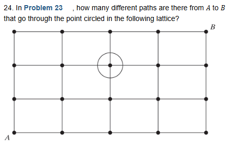
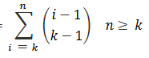
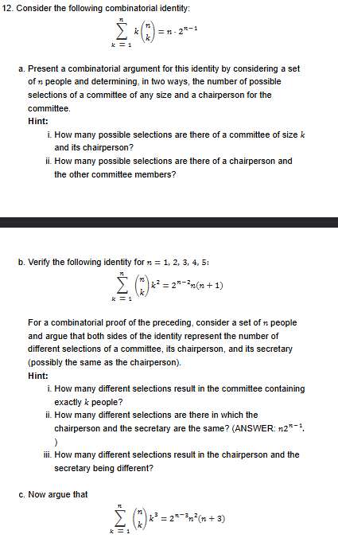

## Homework
```
Page 37-38: 24, 33
Page 40-41: 11, 12
Poker Hands Question

Poker Hands Question:
Find the possible ways to build the following with a 52 card deck
0. High Card
1. One Pair
2. Two Pair
3. Three of a kind
4. Straight
5. Flush
6. Full house
7. Four of a kind
8. Straight Flush
9. Royal Flush
```

## Page 37-38

### 24.



- No repetition Allowed
- Order Doenst matter

(n choose r) = n! / (n -r)! * r!

We have Point A to C and C to B:
- A to C * C to B

#### Part 1: A to C

R R U U

From the 4 paths, pick 2 rights

4! / (4 - 2)! * 2!

4 * 3 * 2 * 1 / (2 * 1) * (2 * 1)

24 / 4 = 6

From A to C there are 6 Paths

#### Part 2: C to B

R R U

From the 3 paths, pick 2 rights

3! / (3 - 2)! * 2!

3 * 2 * 1 / (1) * (2 * 1)

6 / 2 = 3

#### Part 3: A to C and C to B

6 * 3 = 18

There are 18 paths or

**ANS: (4 choose 2) * (3 choose 2)**

### 33.
Delegates from 10 countries, including Russia, France, England, and the United States, are to be seated in a row. How many different seating arrangements are possible if the French and English delegates are to be seated next to each other and the Russian and U.S. delegates are not to be next to each other?

- Order matters (each delegate is distinct)
- Repetition is not allowed

#### Part 1: [F E] 8 Countries

[F E] - 2 ways

[F E] 8 Delegates - 9!

[F E] and 8 Delegates = 2 * 9!

#### Part 2: Find all arrangements where US and Russia are together

[F E] and [R U] and 6 other Delegates - 8!

2 * 2 * 8!

#### Part 3: Subtract Part 2 from Part 1:

**ANS: 9! * 2 - 8! * 2 * 2**

## Page 40-41 (Theory)

### 11.


#### LHS


- I want to count all possible ways to pick k objects from n Set of objects

#### RHS


- i is the highest-numbered member of the subset.
- If we pick i as the highest member, then we need to pick the remaining k - 1 objects.
- The remaining k - 1 objects must come from the i - 1 objects before i, since i is already chosen as the highest member.


(i - 1) choose (k - 1)

- If we repeat this for every possible highest member i from k to n and add them together, we count all subsets of size k.

Σ from i = k to n of (i - 1) choose (k - 1) = n choose k

### 12.


