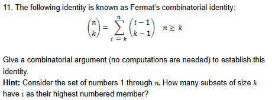
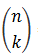
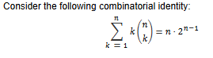
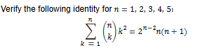
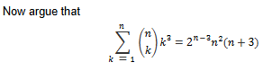

## Homework
```
Page 37-38: 24, 33
Page 40-41: 11, 12
Poker Hands Question

Poker Hands Question:
Find the possible ways to build the following with a 52 card deck
0. High Card
1. One Pair
2. Two Pair
3. Three of a kind
4. Straight
5. Flush
6. Full house
7. Four of a kind
8. Straight Flush
9. Royal Flush
```

## Page 37-38

### 24.


- No repetition Allowed
- Order Doenst matter

(n choose r) = n! / (n -r)! * r!

We have Point A to C and C to B:
- A to C * C to B

#### Part 1: A to C

R R U U

From the 4 paths, pick 2 rights

4! / (4 - 2)! * 2!

4 * 3 * 2 * 1 / (2 * 1) * (2 * 1)

24 / 4 = 6

From A to C there are 6 Paths

#### Part 2: C to B

R R U

From the 3 paths, pick 2 rights

3! / (3 - 2)! * 2!

3 * 2 * 1 / (1) * (2 * 1)

6 / 2 = 3

#### Part 3: A to C and C to B

6 * 3 = 18

There are 18 paths or

**ANS: (4 choose 2) * (3 choose 2)**

### 33.
Delegates from 10 countries, including Russia, France, England, and the United States, are to be seated in a row. How many different seating arrangements are possible if the French and English delegates are to be seated next to each other and the Russian and U.S. delegates are not to be next to each other?

- Order matters (each delegate is distinct)
- Repetition is not allowed

#### Part 1: [F E] 8 Countries

[F E] - 2 ways

[F E] 8 Delegates - 9!

[F E] and 8 Delegates = 2 * 9!

#### Part 2: Find all arrangements where US and Russia are together

[F E] and [R U] and 6 other Delegates - 8!

2 * 2 * 8!

#### Part 3: Subtract Part 2 from Part 1:

**ANS: 9! * 2 - 8! * 2 * 2**

## Page 40-41 (Theory)

### 11.


##### LHS


- I want to count all possible ways to pick k objects from n Set of objects

##### RHS


- i is the highest-numbered member of the subset.
- If we pick i as the highest member, then we need to pick the remaining k - 1 objects.
- The remaining k - 1 objects must come from the i - 1 objects before i, since i is already chosen as the highest member.


(i - 1) choose (k - 1)

- If we repeat this for every possible highest member i from k to n and add them together, we count all subsets of size k.

Σ from i = k to n of (i - 1) choose (k - 1) = n choose k

### 12.
#### a.


Present a combinatorial argument for this identity by considering a set of  people and determining, in two ways, the number of possible selections of a committee of any size and a chairperson for the committee.

Hint:
- i. How many possible selections are there of a committee of size and its chairperson?
- ii. How many possible selections are there of a chairperson and the other committee members?

We want to count the number of ways to choose:

* a committee
* a chairperson from that committee

###### LHS

If the committee has `k` people:

* Choose the `k` committee members:

`n choose k`

* Choose 1 of those `k` people to be chairperson:

`k`

So:

`k * (n choose k)`

Since the committee can have any size from `1` to `n`, we add all possible committee sizes:

`Σ from k = 1 to n of k * (n choose k)`

##### RHS

Count another way:

* Choose the chairperson first:

`n`

* The remaining `n - 1` people each have 2 choices:

  * on the committee
  * not on the committee

So:

`n * 2^(n - 1)`


#### b. 


For a combinatorial proof of the preceding, consider a set of  people and argue that both sides of the identity represent the number of different selections of a committee, its chairperson, and its secretary (possibly the same as the chairperson).

- i. How many different selections result in the committee containing exactly k people?
- ii. How many different selections are there in which the chairperson and the secretary are the same? ANSWER: n * 2^(n-1)
- iii How many different selections result in the chairperson and the secretary being different?

We want to count the number of ways to choose:

* a committee
* a chairperson
* a secretary

The chairperson and secretary can be the same person.

##### LHS

If the committee has `k` people:

* Choose the committee:

`n choose k`

* Choose the chairperson:

`k`

* Choose the secretary:

`k`

So:

`(n choose k) * k^2`

Add this for every possible committee size:

`Σ from k = 1 to n of (n choose k) * k^2`

##### RHS

There are 2 cases.

If the chairperson and secretary are the same person:

* Choose that person:

`n`

* The remaining `n - 1` people are either in or out of the committee:

`2^(n - 1)`

So:

`n * 2^(n - 1)`

If the chairperson and secretary are different:

* Choose chairperson:

`n`

* Choose secretary:

`n - 1`

* Remaining `n - 2` people are either in or out:

`2^(n - 2)`

So:

`n * (n - 1) * 2^(n - 2)`

Add both cases:

`n * 2^(n - 1) + n * (n - 1) * 2^(n - 2)`

Simplifies to:

`n * (n + 1) * 2^(n - 2)`


#### c.


We want to count:

* a committee
* a chairperson
* a secretary
* a treasurer

The 3 officers can be the same or different people.

##### LHS

If the committee has `k` people:

* Choose the committee:

`n choose k`

* Choose chairperson:

`k`

* Choose secretary:

`k`

* Choose treasurer:

`k`

So:

`(n choose k) * k^3`

Add for every committee size:

`Σ from k = 1 to n of (n choose k) * k^3`

##### RHS

There are 3 cases.

All 3 officers are the same person:

`n * 2^(n - 1)`

Exactly 2 officers are the same person:

* 3 ways to choose which 2 jobs are held by the same person
* `n` choices for that person
* `n - 1` choices for the other officer
* remaining people are in or out

So:

`3 * n * (n - 1) * 2^(n - 2)`

All 3 officers are different:

`n * (n - 1) * (n - 2) * 2^(n - 3)`

Add all 3 cases:

`n * 2^(n - 1) + 3 * n * (n - 1) * 2^(n - 2) + n * (n - 1) * (n - 2) * 2^(n - 3)`

This simplifies to:

`n^2 * (n + 3) * 2^(n - 3)`


## Poker Hands

**13 Distinct Cards:**
- 2, 3, 4, 5, 6, 7, 8, 9, 10, J, Q, K, A

**4 Suits of Cards:**
- H, S, C, D

**Poker Hand: 5 Cards**

**Total: 52 Cards**

#### 0. High Card

**First:** Pick 5 distinct ranks:
- No repetition
- Order doesn't matter

13 Choose 5

**Second:** Remove all straights from the rank choices:
- Using the convention that A,2,3,4,5 is NOT a straight
- There are 9 straight rank patterns

(13 Choose 5) - 9

**Third:** Choose suits for the 5 cards:
- Repetition allowed
- Order matters (each rank gets its own suit)

4^5

**Fourth:** Remove flushes:
- All 5 cards same suit
- There are 4 possible flush suit choices

4

**ANS:** ((13 Choose 5) - 9) * (4^5 - 4)

#### 1. One Pair

**First:** Pick a distinct Card:
- No repetition
- Order doesnt Matters

13 Choose 1

**Second:** Pick any two distinct suits for that card:
- No repetition
- Order doesnt matter

4 Choose 2

**Third:** Pick 3 Distinct cards that were not chosen yet
- No repetition
- Order doesnt matter

12 Choose 3

**Fourth:** Pick a suit for each distinct card:
- Repetition allowed
- Order matters (each suit belong to different rank)

4^3

**ANS: (13 choose 1) * (4 choose 2) * (12 Choose 3) * (4^3)**

#### 2. Two Pair

First Pair and Second Pair does not change the value of the hand, pair ranks are unordered

**First:** Pick two distinct Card:
- No repetition
- Order doesnt Matters

13 Choose 2

**Second:** Pick any two distinct suits for first pair:
- No repetition
- Order doesnt matter

4 Choose 2

**Second:** Pick any two distinct suits for second pair:
- No repetition
- Order doesnt matter

4 Choose 2

**Fifth:** Pick 1 Distinct cards that was not chosen yet
- No repetition
- Order doesnt matter

11 Choose 1

**Sixth:** Pick a suit for each distinct card:
- Repetition allowed
- Order matters (each suit belong to different rank)

4^1

**ANS: (13 Choose 2) * (4 Choose 2) * (4 Choose 2) * (11 Choose 1) * 4**

#### 3. Three of a kind

**First:** Pick a distinct Card:
- No repetition
- Order doesnt Matters

13 Choose 1

**Second:** Pick any three distinct suits for that card:
- No repetition
- Order doesnt matter

4 Choose 3

**Third:** Pick a distinct Card that wasn't chosen yet:
- No repetition
- Order doesnt Matters

12 Choose 1

**Third:** Pick a distinct Card that wasn't chosen yet:
- No repetition
- Order doesnt Matters

11 Choose 1

**Fourth:** Pick any two distinct suits for each card:
- No repetition
- Order doesnt matter

4^2

**ANS: (13 choose 1) * (4 choose 3) * (12 Choose 1) * (11 Choose 1)* (4^2)**

#### 4. Straight

2,3,4,5,6,7,8,9,10,J,Q,K,A

There are 9 ways to make a straight (not straight flushes or royal straight flushes)
- highest card to start a straight is 10 in 2,3,4,5,6,7,8,9,10,J,Q,K,A

#### 5. Flush

Remove straights, straight flushes and royal flushes from the choices

**First:** Pick a distinct suit:
- No repetition
- Order doesnt Matters

4 Choose 1

**Second:** Pick 5 distinct cards:
- No repetition
- Order doesnt Matters

13 Choose 5

**Third:** Subtract Straights from 5 distinct caards:
- Includes straight flush and royal flush

9

**ANS: (4 Choose 1) * ((13 Choose 5) - 9)**

#### 6. Full house

**First:** Pick a distinct Card:
- No repetition
- Order doesnt Matters

13 Choose 1

**Second:** Pick any three distinct suits for that card:
- No repetition
- Order doesnt matter

4 Choose 3

**Third:** Pick a distinct Card that wasn't chosen yet:
- No repetition
- Order doesnt Matters

12 Choose 1

**Fourth:** Pick any two distinct suits for that card:
- No repetition
- Order doesnt matter

4 Choose 2

**ANS: (13 choose 1) * (4 choose 3) * (12 choose 1) * (4 choose 2)**

#### 7. Four of a kind

**First:** Pick a distinct Card:
- No repetition
- Order doesnt Matters

13 Choose 1

**Second:** Pick any four distinct suits for that card:
- No repetition
- Order doesnt matter

4 Choose 4

**Third:** Pick a distinct Card that wasn't chosen yet:
- No repetition
- Order doesnt Matters

12 Choose 1

**Fourth:** Pick any distinct suits for that card:
- No repetition
- Order doesnt matter

4

**ANS: (13 choose 1) * (4 choose 4) * (12 choose 1) * 4**

#### 8. Straight Flush

**First:** Pick a distinct suit:
- No repetition
- Order doesnt Matters

4 Choose 1

**Second:** How many ways to make a straight:
- No repetition
- Order doesnt matter

9

**ANS: (4 Choose 1) * 9**

#### 9. Royal Flush

Only 4 ways to make a Royal Flush

10, J, Q, K, A

for each suit

**ANS: 4**
