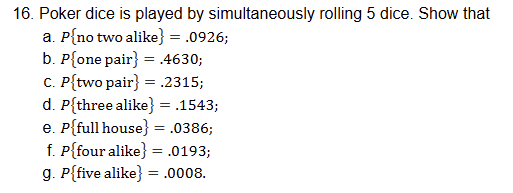

## Homework

### Page 85-86: 8, 9, 10, 11, 13, 16

8. Suppose that A and B are mutually exclusive events for which P(A) = .3 and P(B) = .5 What is the probability that
- a. either A or B occurs?
```
P(A U B) = P(A) + P(B) = .8
Since they are mutually exclusive
```
- b. A occurs but B does not?
```
P(A) = .3
Answer is .3
```
- c. both A and B occur?
```
0 because A and B are mutually exclusive
```

9. A retail establishment accepts either the American Express or the VISA credit card. A total of 24 percent of its customers carry an American Express card, 61 percent carry a VISA card, and 11 percent carry both cards. What percentage of its customers carry a credit card that the establishment will accept?

10. Sixty percent of the students at a certain school wear neither a ring nor a necklace. Twenty percent wear a ring and 30 percent wear a necklace. If one of the students is chosen randomly, what is the probability that this student is
wearing

- a. a ring or a necklace?
- b. a ring and a necklace?

11. A total of 28 percent of American males smoke cigarettes, 7 percent smoke cigars, and 5 percent smoke both cigars and cigarettes.
- a. What percentage of males smokes neither cigars nor cigarettes?
- b. What percentage smokes cigars but not cigarettes?

13. A certain town with a population of 100,000 has 3 newspapers: I, II, and III. The proportions of townspeople who read these papers are as follows:
- I: 10 percent I and II: 8 percent I and II and III: 1 percent
- II: 30 percent I and III: 2 percent
- III: 5 percent II and III: 4 percent
(The list tells us, for instance, that 8000 people read newspapers I and II.)

- a. Find the number of people who read only one newspaper.
- b. How many people read at least two newspapers?
- c. If I and III are morning papers and II is an evening paper, how many people read at least one morning paper plus an evening paper?
- d. How many people do not read any newspapers?
- e. How many people read only one morning paper and one evening paper?

16. 


