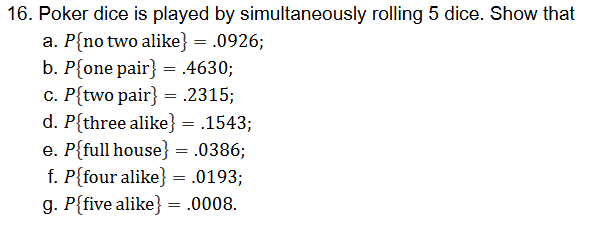

### Homework: Page 51: 16, 18, 21, 23, 27, 36
- Review on Tuesday before exam

### Worked-solution guide

For these questions, start by identifying **one equally likely outcome**. Then use

\[
P(E)=\frac{\text{number of favorable outcomes}}{\text{number of equally likely outcomes}}.
\]

Explain what each factor counts. Exact combinations, factorials, and fractions are sufficient; decimal approximations below are included only to check the values requested in Problem 16.

| Problem | What tells us which method to use? |
|---|---|
| Three balls | Select distinct balls without replacement: combinations, or disjoint color-order cases. |
| 16 | Five dice have labeled positions, and face values can repeat: count ordered rolls and repeated-value patterns. |
| 18 | Select an unordered pair of distinct cards: combinations. |
| 21 | The unit selected changes from a family to a child: change the sample space and its denominator. |
| 23 | Two dice give ordered pairs; count the pairs satisfying the inequality. |
| 27 | The game stops at the first red ball: split into disjoint cases according to when A wins. |
| 36 | Choose the required rank and then distinct cards of that rank: combinations. |

## 3 Ball Question

Example: 3 balls randomly drwan from a back of 6 white, 5 black. Find P(2B, 1W):
```
1. P = ways to get 2B, 1W / total # of ways to get 3 of anykind

P(B1, W1, B2) = P(B1, W1, B3) = P(B1, W1, B4) = ... = P(B5, W6, B5)

S all triples from 
- B1, B2, ... B5
- W1, ... W6

P(B1, W1) = P(B1, W1, B2) + P(B1, W1, B3) + P(B1, W1, B4) + P(B1, W1, B5)
P(B1, W2) = P(B1, W1, B2) + P(B1, W1, B3) + P(B1, W1, B4) + P(B1, W1, B5)

1. 1 at a time?
P(B,W,B) + P(B,B,W) + P(W,B,B)

P(B,W,B) = (5/11) * (6/10) * (4/9)
P(B,B,W) = (5/11) * (4/10) * (6/9)
P(W,B,B) = (6/11) * (5/10) * (4/10)

2. All three at once
```

### Worked solution: three balls

Assume the draws are uniform **without replacement**, as indicated by the decreasing denominators in the notes. Treat the 11 balls as distinct, even when they share a color.

**Method 1: choose all three at once.**

- Order does not matter: the same three balls form the same selection regardless of drawing order.
- A physical ball cannot repeat: there is no replacement.
- Choose 2 of the 5 black balls: \(\binom{5}{2}\).
- Choose 1 of the 6 white balls: \(\binom{6}{1}\).
- Count all three-ball selections: \(\binom{11}{3}\).

Therefore,

\[
\boxed{P(2B,1W)=\frac{\binom{5}{2}\binom{6}{1}}{\binom{11}{3}}.}
\]

The numerator and denominator both count **unordered sets of three distinct balls**. Having two black balls does not mean a physical ball was repeated.

**Method 2: draw one at a time.**

Exactly two black balls can occur in three disjoint color orders:

\[
BBW,\qquad BWB,\qquad WBB.
\]

For each order, multiply the successive probabilities using the contents remaining in the bag:

\[
\begin{aligned}
P(BBW)&=\frac5{11}\frac4{10}\frac6{9},\\
P(BWB)&=\frac5{11}\frac6{10}\frac4{9},\\
P(WBB)&=\frac6{11}\frac5{10}\frac4{9}.
\end{aligned}
\]

The color-order events cannot occur together, so add them:

\[
\boxed{P(2B,1W)=
\frac5{11}\frac4{10}\frac6{9}
+\frac5{11}\frac6{10}\frac4{9}
+\frac6{11}\frac5{10}\frac4{9}.}
\]

This equals the combination answer above. These products use the probabilities **given the earlier draws**; the draws are not independent.

**Corrections to the copied notes:**

- In the WBB term, the final denominator is **9**, not 10.
- An outcome containing the same physical ball twice, such as \((B_5,W_6,B_5)\), is impossible without replacement.
- For the all-at-once model, use three-element subsets. An expression such as \(P(B_1,W_1)\) needs an event definition: if it means that the selected set contains both specified balls, the possible third balls must be listed without repeating either of them.

## 16



### Worked solution: poker dice

Assume five independent fair six-sided dice. Label the dice 1 through 5, even though they are rolled simultaneously.

One outcome is an ordered five-tuple such as \((2,2,4,5,6)\). Each position has 6 choices, so

\[
|S|=6^5.
\]

Every ordered outcome is equally likely. An unordered collection of face values is **not** equally likely to every other such collection, so we must account for how many ways its values can occupy the five dice.

#### a. No two alike: pattern 1 + 1 + 1 + 1 + 1

1. Choose 5 different face values from the 6 possibilities: \(\binom65\).
2. Assign those values to the five labeled dice: \(5!\).

\[
\boxed{P(\text{no two alike})=\frac{\binom65\,5!}{6^5}\approx0.0926.}
\]

Equivalently, the numerator is \(6\cdot5\cdot4\cdot3\cdot2\).

#### b. Exactly one pair: pattern 2 + 1 + 1 + 1

1. Choose the repeated face: \(\binom61\).
2. Choose 3 distinct other faces from the remaining 5: \(\binom53\).
3. Arrange the five values: \(5!/2!\). Swapping the two equal values does not produce a new roll.

\[
\boxed{P(\text{one pair})=
\frac{\binom61\binom53\,\dfrac{5!}{2!}}{6^5}
\approx0.4630.}
\]

The three single values must differ from each other; otherwise we would count two pairs or a larger repeated group.

#### c. Exactly two pairs: pattern 2 + 2 + 1

1. Choose the two pair values as an unordered set: \(\binom62\).
2. Choose the remaining single value from the other 4 faces: \(\binom41\).
3. Arrange the values: \(5!/(2!2!)\), removing swaps within each equal pair.

\[
\boxed{P(\text{two pairs})=
\frac{\binom62\binom41\,\dfrac{5!}{2!2!}}{6^5}
\approx0.2315.}
\]

Do not replace \(\binom62\) with \(6\cdot5\): there is no distinguished first pair and second pair.

#### d. Exactly three alike, excluding a full house: pattern 3 + 1 + 1

1. Choose the triple's value: \(\binom61\).
2. Choose two distinct other values: \(\binom52\).
3. Arrange the values: \(5!/3!\).

\[
\boxed{P(\text{three alike})=
\frac{\binom61\binom52\,\dfrac{5!}{3!}}{6^5}
\approx0.1543.}
\]

The two single values must differ; equal single values would form a full house.

#### e. Full house: pattern 3 + 2

1. Choose the triple's value: \(\binom61\).
2. Choose the pair's different value: \(\binom51\).
3. Choose which three dice show the triple: \(\binom53\). The remaining two dice show the pair.

\[
\boxed{P(\text{full house})=
\frac{\binom61\binom51\binom53}{6^5}
\approx0.0386.}
\]

Unlike two pairs, the triple and pair have different roles. We therefore do not divide the choice of these two values by \(2!\).

#### f. Exactly four alike: pattern 4 + 1

1. Choose the four-of-a-kind value: \(\binom61\).
2. Choose the different single value: \(\binom51\).
3. Choose the four dice showing the repeated value: \(\binom54\).

\[
\boxed{P(\text{four alike})=
\frac{\binom61\binom51\binom54}{6^5}
\approx0.0193.}
\]

#### g. Five alike: pattern 5

Choose the one face value shared by all five dice: \(\binom61\). There is only one arrangement for each chosen value.

\[
\boxed{P(\text{five alike})=\frac{\binom61}{6^5}\approx0.0008.}
\]

**Check:** The seven patterns are disjoint and cover all rolls. Their favorable counts are respectively 720, 3600, 1800, 1200, 300, 150, and 6; their sum is \(6^5\). The exact probabilities therefore sum to 1. The displayed rounded decimals need not sum to exactly 1.

## 18

18. Two cards are randomly selected from an ordinary playing deck. What is the probability that they form a blackjack? That is, what is the probability that one of the cards is an ace and the other one is either a ten, a jack, a queen, or a king?

### Worked solution

The two cards are selected uniformly without replacement. Count unordered two-card hands.

- Order does not matter.
- A physical card cannot repeat.
- There are 4 aces.
- There are \(4\cdot4=16\) cards with rank 10, J, Q, or K: four ranks, each with four suits.

Choose one ace **and** one of the 16 eligible other cards:

\[
\#\text{favorable hands}=\binom41\binom{16}{1}.
\]

All two-card hands number \(\binom{52}{2}\), so

\[
\boxed{P(\text{blackjack})=\frac{\binom41\binom{16}{1}}{\binom{52}{2}}.}
\]

No extra factor of 2 is needed: the unordered hand containing a particular ace and king is counted once. If we instead track drawing order, the equivalent answer is

\[
\frac4{52}\frac{16}{51}+\frac{16}{52}\frac4{51}.
\]

## 21

21. A small community organization consists of 20 families, of which 4 have one child, 8 have two children, 5 have three children, 2 have four children, and 1 has five children.
- a. If one of these families is chosen at random, what is the probability it has i children 𝑖 = 1, 2, 3, 4, 5?
- b. If one of the children is randomly chosen, what is the probability that child comes from a family having i children, i = 1,2,3,4,5?

### Worked solution

The important change is **what is being chosen uniformly**. In part (a), the outcomes are families. In part (b), the outcomes are individual children.

Let \(f_i\) be the number of families with \(i\) children:

\[
(f_1,f_2,f_3,f_4,f_5)=(4,8,5,2,1).
\]

#### a. Choose one of the 20 families

Every family has probability \(1/20\). There are \(f_i\) favorable families, so

\[
\boxed{P(\text{chosen family has }i\text{ children})=\frac{f_i}{20}.}
\]

#### b. Choose one of the children

First count the children:

\[
N=1\cdot4+2\cdot8+3\cdot5+4\cdot2+5\cdot1=48.
\]

The \(f_i\) families of size \(i\) contribute \(i f_i\) children. Therefore,

\[
\boxed{P(\text{chosen child comes from an }i\text{-child family})=
\frac{i f_i}{48}.}
\]

| Number of children, i | Number of families, f_i | Part (a): choose a family | Children in those families, i f_i | Part (b): choose a child |
|---|---:|---:|---:|---:|
| 1 | 4 | 4/20 | 4 | 4/48 |
| 2 | 8 | 8/20 | 16 | 16/48 |
| 3 | 5 | 5/20 | 15 | 15/48 |
| 4 | 2 | 2/20 | 8 | 8/48 |
| 5 | 1 | 1/20 | 5 | 5/48 |

**Why the answers differ:** A family with three children supplies three possible child outcomes. Families are equally likely in part (a), but larger families are more likely to be represented when a child is chosen in part (b). The five family-size categories are not equally likely in either experiment.

## 23

23. A pair of fair dice is rolled. What is the probability that the second die lands on a higher value than does the first?

### Worked solution

Use the usual independent-dice model. An outcome is the ordered pair \((d_1,d_2)\). There are \(6^2\) equally likely outcomes.

The event is \(d_2>d_1\).

**Counting method:** Choose any two different face values from the six possibilities. Exactly one ordering puts the smaller value on the first die and the larger value on the second. Thus the favorable count is \(\binom62\), and

\[
\boxed{P(d_2>d_1)=\frac{\binom62}{6^2}.}
\]

Although the sample space is ordered, a combination works in the numerator because the inequality determines a **unique ordering** of each chosen pair of values.

**Symmetry method:** The six ties \((1,1),\ldots,(6,6)\) have probability \(6/6^2\). Swapping the dice pairs every outcome with \(d_2>d_1\) with one having \(d_1>d_2\). These two events have the same probability, say \(p\). Therefore,

\[
2p+\frac6{6^2}=1,
\qquad
\boxed{p=\frac12\left(1-\frac6{6^2}\right).}
\]

It is not simply \(1/2\), because ties are possible.

## 27

27. An urn contains 3 red and 7 black balls. Players A and B withdraw balls from the urn consecutively until a red ball is selected. Find the probability that A selects the red ball. ( A draws the first ball, then B and so on. There is no replacement of the balls drawn.)

### Worked solution

Assume each remaining ball is equally likely to be drawn. A draws on turns 1, 3, 5, 7, ...; B draws on turns 2, 4, 6, 8, ... .

There are only 7 black balls, so the first red must appear by draw 8. Consequently A can win only on draws **1, 3, 5, or 7**.

Here R means red and B means a black ball, not player B. A wins through exactly one of these disjoint stopped color sequences:

\[
R,\qquad BBR,\qquad BBBBR,\qquad BBBBBBR.
\]

#### Method 1: split by A's winning turn

Multiply probabilities within each sequence, updating the urn after every black draw:

\[
\begin{aligned}
P(\text{win on draw 1})&=\frac3{10},\\[3pt]
P(\text{win on draw 3})&=\frac7{10}\frac6{9}\frac3{8},\\[3pt]
P(\text{win on draw 5})&=\frac7{10}\frac6{9}\frac5{8}\frac4{7}\frac3{6},\\[3pt]
P(\text{win on draw 7})&=\frac7{10}\frac6{9}\frac5{8}\frac4{7}\frac3{6}\frac2{5}\frac3{4}.
\end{aligned}
\]

Add the four disjoint cases:

\[
\boxed{\begin{aligned}
P(A\text{ wins})={}&\frac3{10}
+\frac7{10}\frac6{9}\frac3{8}\\
&+\frac7{10}\frac6{9}\frac5{8}\frac4{7}\frac3{6}\\
&+\frac7{10}\frac6{9}\frac5{8}\frac4{7}\frac3{6}\frac2{5}\frac3{4}.
\end{aligned}}
\]

There is no extra arrangement factor: every draw before the stopping red must be black. The products use conditional probabilities, since the urn changes after each draw.

#### Method 2: count the positions of the three red balls

Imagine randomly ordering all 10 distinct balls before play. Revealing them in that order produces the same experiment as uniform drawing without replacement. The game still stops at the first red; imagining later balls only helps us count.

The three red positions are uniformly distributed among the \(\binom{10}{3}\) three-position subsets. To see equal likelihood, every fixed set of red positions allows \(3!7!\) orders of the distinct balls.

- First red at position 1: choose the other two red positions from positions 2 through 10, giving \(\binom92\).
- First red at position 3: positions 1 and 2 must be black; choose the other red positions from 4 through 10, giving \(\binom72\).
- First red at position 5: choose the other red positions from 6 through 10, giving \(\binom52\).
- First red at position 7: choose the other red positions from 8 through 10, giving \(\binom32\).

Therefore an equivalent exact answer is

\[
\boxed{P(A\text{ wins})=
\frac{\binom92+\binom72+\binom52+\binom32}{\binom{10}{3}}.}
\]

The two methods agree. Do not use a constant red probability \(3/10\) on every turn: after black balls are removed, the red proportion increases.

## 36

36. Two cards are chosen at random from a deck of 52 playing cards. What is the probability that they
- a. are both aces?
- b. have the same value?

### Worked solution

Choose two distinct cards uniformly without replacement. Order does not matter, so the common denominator is \(\binom{52}{2}\).

#### a. Both aces

Choose any 2 of the 4 aces:

\[
\boxed{P(\text{both aces})=\frac{\binom42}{\binom{52}{2}}.}
\]

An equivalent sequential expression is \((4/52)(3/51)\). Choosing the second ace leaves only 3 aces and 51 cards.

#### b. Same value

Here **same value means same rank**: two kings, two sevens, two aces, etc. It does not mean the same blackjack point value; a ten and a king are different ranks.

1. Choose their common rank from the 13 ranks: \(\binom{13}{1}\).
2. Choose 2 of the 4 cards of that rank: \(\binom42\).

\[
\boxed{P(\text{same rank})=
\frac{\binom{13}{1}\binom42}{\binom{52}{2}}.}
\]

Each favorable hand has exactly one common rank, so it is counted once. As a check, after any first card there are exactly 3 matching-rank cards among the remaining 51, giving the equivalent probability \(3/51\).
