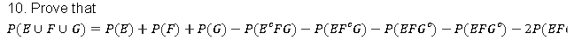
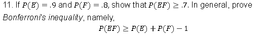

pg 53: 44
pg 55: 10, 11
pg 57: 6, 7

44. Five people, designated as A,B,C,D,E are arranged in linear order. Assuming that each possible order is equally likely, what is the probability that
- a. there is exactly one person between A and B?
- b. there are exactly two people between A and B?
- c. there are three people between A and B?

10. 

11. 

6. Urn B contains 3 red and 3 black balls, whereas urn B contains 4 red and 6 black balls. If a ball is randomly selected from each urn, what is the probability that the balls will be the same color?

7. In a state lottery, a player must choose 8 of the numbers from 1 to 40. The lottery commission then performs an experiment that selects 8 of these 40 numbers. Assuming that the choice of the lottery commission is equally likely to be any of the (40 choose 8) combinations, what is the probability that a player has:
- a. all 8 of the numbers selected by the lottery commission?
- b. 7 of the numbers selected by the lottery commission?
- c. at least 6 of the numbers selected by the lottery commission?